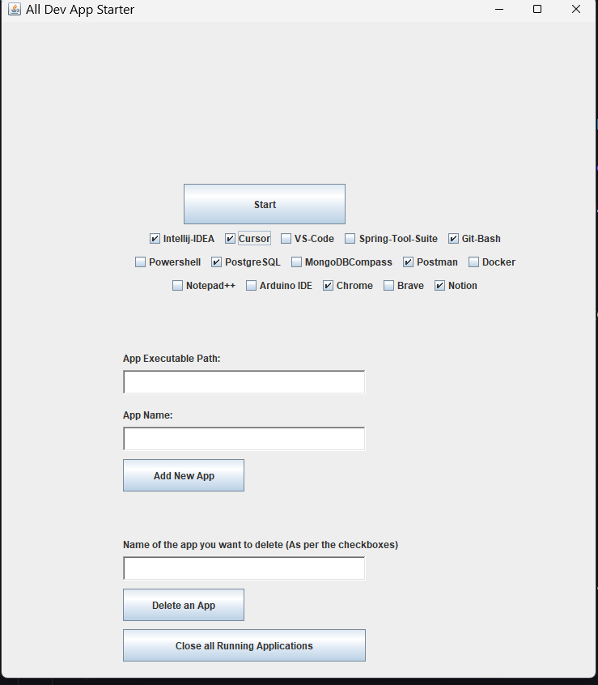

# App-Starter
Opens the selected apps automatically, and closes all of the listed applications at once.

Context:-
I do backend development using Spring Boot.

Every time I open my PC and start to work on my project, I always need to open multiple applications like:

- Intellij-IDEA  
- PostgreSQL  
- MongoDB  
- Cursor — Creates frontend for me :)  
- Git-Bash  
- Postman  
- Chrome  
- Notion  
- ...etc  

So the flow was like —  
Double click on an app → if it starts immediately, minimize and open another one → if it doesn't start immediately, go on and open other apps.

I had some experience with making small apps using AWT and Swing, so I created this app in my free time.
